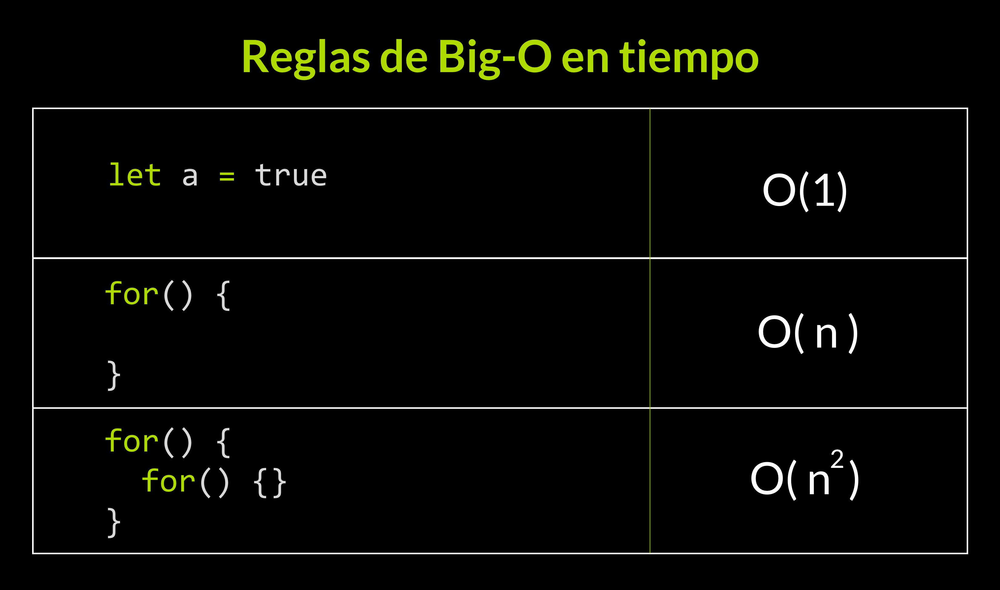
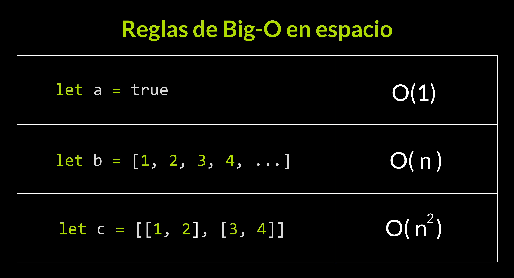
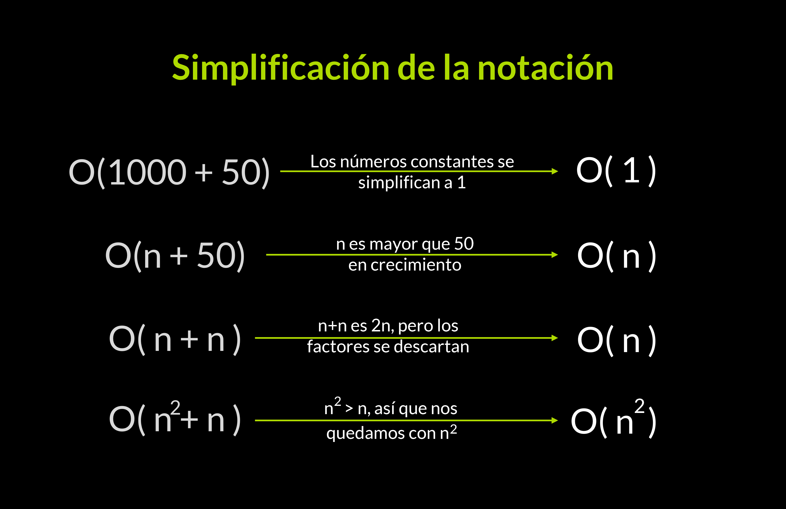
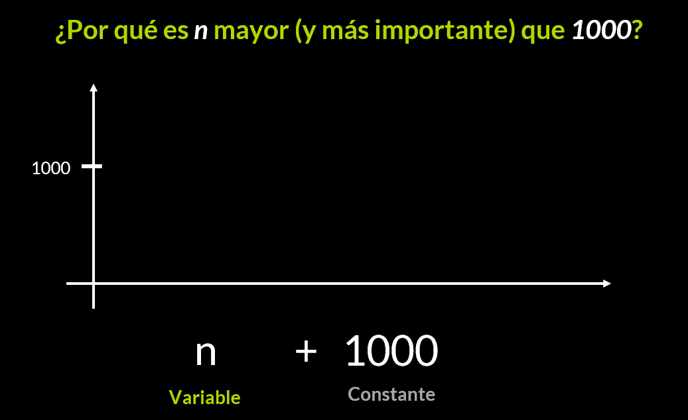

# Clases del Curso de Complejidad Algorítmica con JavaScript

## Estructura de un algoritmo

Un algoritmo consiste en una secuencia de instrucciones que nos llevan a una solución,
los algoritmos están compuestos por 3 partes

- Entrada: la entra de datos

- Proceso: el proceso a realizar

- Salida: la salida de datos o el resultado del algoritmo (esta etapa es opcional)

## ¿Cómo elegir un buen algoritmo?

En programacion se caracteriza que muchos algoritmos diferentes son capaces de resolver el mismo problema.

Lo cual hace que debamos preguntarnos si estamos usando el mejor algoritmo

Para encontrar esto debemos considerar

**Tiempo del algoritmo**
¿Cuánto tiempo tarda el algoritmo en ejecutarse?
**Espacio del algoritmo**
¿Cuánto espacio en memoria ocupa el algoritmo (recursos de memoria ram y memoria en disco)?

Es comun que mejorar uno de estos aspectos empeora la performance del otro.

En el caso de JavaScript es un factor mucho mas importante en javascript ya que de por si estos programas suelen ocupar mucho espacio en memoria

La pregunta base de este curso es: **¿Cómo elegir un buen algoritmo?**

🔍 Para encontrar un buen algoritmo podemos ver qué tanto tarda en ejecutarse, o qué tanto espacio en la memoria ocupa.

⌚ En particular en JavaScript es más relevante apuntar al tiempo, que al espacio. Porque en el código JavaScript usualmente no corre en dispositivos con memoria muy limitada (como en dispositivos embebidos).

⚡ Esto no significa que no haya casos particulares, o que el espacio siempre sea menos importante que el tiempo, sólo es el ambiente del software con JavaScript.

## Introducción a complejidad algorítmica

### Recursos

- **Tiempo**
  Representado en milisengundo, segundos, minutos.

- **Espacio**
  representado en bytes, kilobytes, megabytes, etc...

### Medir los recursos

para obtener cuantos recursos utliza un algoritmo, **solo** medimos los recursos.

Vamos a tomar cuánto tiempo y cuánto espacio ocupa un algoritmo.

### Teoría de la complejidad

Es el estudio del consumo de recursos que un algoritmo ocupa.

**La complejidad se basa en el crecimiento**
En la complejidad queremos entender el crecimiento de recursos, no su tamaño.
El **crecimiento de recursos** importa.

✨ Empezamos el módulo de Complejidad Algorítmica.

🚗 Ok, ¿Cómo sabemos cuando un coche es más rápido que otro? Bueno, si los ponemos en un tramo igual, y tomamos nuestros relojes para medir cuánto tardan, podremos ver que uno llega más rápido que otro a la meta 🏁. Que un coche tarda menos que otro. Tal vez unos 10, o 20, o 30 minutos.

Entonces, medir es clave para determinar el mejor. Pero la Complejidad en sí no trata de si un coche llega 10, o 20 o 30 minutos más rápido a la meta. Si no del ritmo con el que aumenta. Esto lo veremos en todo el módulo de Complejidad.

## Complejidad temporal

La complejidad temporal es la tasa de crecimiento del tiempo de ejecución del algoritmo en relación con el crecimiento de la entrada de datos del algoritmo.

Para obtenerla se mide el tiempo de ejecucion del algoritmo en varios casos, cada caso con una mayor informacion de entrada que el anterior.

Se mide cuanto tiempo toma en ejecutarse el algoritmo conforme aumenta la entrada de datos. ya que buscamos medir el ritmo con el que aumenta el tiempo de ejecucion conforme aumente la entrada de datos.

Ejemplo dos algoritmos:

**El algoritmo A** le toma realizar la operacion
10 segundos con 10 datos
20 segundos con 20 datos
30 segundos con 30 datos
40 segundos con 40 datos

**El algoritmo B** le toma realizar la operacion
20 segundos con 10 datos
20 segundos con 20 datos
20 segundos con 30 datos
20 segundos con 40 datos

En este caso podemos ver que el algoritmo **B** tiene una mejor complejidad temporal ya que su tiempo de ejecucion se mantiene en el tiempo mientras que el algoritmo **A** tiene una taza de crecimiento lineal.

## Complejidad temporal en práctica

En javascript tenemos la **Interfaz performance**

El método **performance.now()** nos ayuda a **medir el tiempo** entre dos líneas de código en **milisegundos**

Existe otro método: **console.time()**, pero no es tan preciso como **performance.now()**

📈👉 [Herramienta de Visualización de Complejidad Temporal](https://radiant-anchorage-11930.herokuapp.com/)

[perf_hooks.html#perf_hooks_performance_now](https://nodejs.org/api/perf_hooks.html#perf_hooks_performance_now)

[hr-time/#dom-performance-now](https://w3c.github.io/hr-time/#dom-performance-now)

## Complejidad espacial

Ejemplo buscando un algoritmo que ocupe poco espacio Teniendo multiples algoritmos:

**El algoritmo Vision** realiza la operación

Con 10 datos la realiza ocupando 10 Kilobytes
Con 20 datos la realiza ocupando 20 Kilobytes
Con 30 datos la realiza ocupando 30 Kilobytes

**El algoritmo Nova** realiza la operación

Con 10 datos la realiza ocupando 10 Kilobytes
Con 20 datos la realiza ocupando 100 Kilobytes
Con 30 datos la realiza ocupando 1000 Kilobytes

### Memoria

cuando trabajamos con grandes cantidades de datos tendremos que almacenar información en otras partes

### Espacio auxiliar

La complejidad espacial el **espacio auxiliar** y el espacio ocupado por los datos de entrada

es más importante que el espacio de entrada, ya que el espacio auxiliar es generado por las operaciones internas que realice nuestro algoritmo. Todos los algoritmos ocupan el mismo tamaño en su entrada, pero el espacio auxiliar varía según que lógica apliquemos en el algoritmo.

Por ejemplo, el espacio auxiliar Puede ser generado por algoritmos de ordenamiento al crear nuevas variables. O las técnicas que usemos para resolver el problema, las creaciones de listas y diccionarios en el algoritmo aumentan el espacio auxiliar utilizado por el algoritmo.

## Complejidad espacial en práctica

Una de las particulariadades la complejidad espacial, es que varia el espacio y la forma de medirlo segun el lenguage de programacion, por los interpretes o compiladores utilizados

¿Cómo medimos un recurso?
⌚ En Complejidad Temporal podemos usar funciones como performance.now y console.time para medir el tiempo en que se ejecuta un algoritmo.

🌌 En Complejidad Espacial es diferente. Cada compilador asigna un espacio distinto de memoria para almacenar números o palabras.

📦 La diversidad de tamaños y formas con las que el compilador almacena información es interesante, pero para el propósito que tenemos, podemos simplificarlo a contar cuántas variables se definen para almacenar arreglos, números o cadenas.

En la complejidad Espacial vamos contando las variables que se van creando y que tipos de variables son las que se están creando.

## El estado de la Complejidad

### Otras complejidades existen

- Accesos a la memoria
- Procesos parelelos
- Comparaciones
- Entre otras mas

### Complejidad en el futuro

Si descubrimos interesante optimizar el uso de un recurso en computación, allí tendremos un nuevo campo de estudio de complejidad

### ♾ Los recursos que se analizan en Ciencias de la Computación van más allá del tiempo y del espacio. No hay límite

🌀 ¿Necesitas que un algoritmo ejecute pocas funciones? Nueva complejidad. ¿Necesitas que un algoritmo no realice muchos arreglos? Nueva complejidad. ¿Necesitas un algoritmo que utilice la menor cantidad de otros algoritmos? Nueva complejidad.

🚀 ¿Sabes qué es lo más genial? Que en en las siguientes clases entenderás a evaluar algoritmos con Big-O, una notación que funciona para todos los tipos de complejidad que existen y que existirán. ¡Te veo allá!

## Introducción a análisis asintótico

**Análisis asintótico**
Es un método para describir el comportamiento limitante de una función

Ver la notacion de ejecucion de funciones

[Visualización de Complejidad Temporal Big-O](https://radiant-anchorage-11930.herokuapp.com/)

Ver graficamente las funciones en un plano cartesioano

[GeoGebra Calculator](https://www.geogebra.org/calculator)

📕 Las mediciones tienden a tener números muy inexactos. Casi nunca se trata con 10, 20, 30 o 40. Sino con 14.143, 25.951, 32.457 hasta 41.245.

➕ Súmale que además si vuelves a medir cuánto tarda un algoritmo en ejecutarse una y otra vez, tendrás resultados que varían mucho.

¿Recuerdas Pi (π)? Bien, con Pi tenemos 3.141592.... Pero sólo necesitamos una parte para trabajar con Pi. Y encontramos que3.14 es similar a π.

Lo mismo sucede aquí. El Análisis Asintótico es la forma con la que encontramos una función matemática similar a la medición de la complejidad.

## Notación Big-O

[Visualizador grafica de funciones matematicas](https://www.geogebra.org/calculator)

**¿Porque necesitamos una notación?**
La queremos usar para poder simplificar el análisis de la complejidad computacional

buscamos poder simplificar la representación de la complejidad

**¿Qué buscamos con Big-O?**
Buscamos descubrir una **función** (constante, lineal, polinomial, logarítmica o exponencial) que sea **mayor o igual** que la complejidad de un algoritmo.

### Clases de Big-O

| Clase     | Crecimiento | Formula     | Emoji |
| --------- | ----------- | ----------- | ----- |
| O(1)      | Constante   | $f(x) = 1 $ | 😊     |
| O(log(n)) | Logarítmico | $f(x) = \log_{10}(x) $ | 🙂     |
| O(n)      | Lineal      | $f(x) = x $ | 😶     |
| O($n^2$)  | Cuadrático  | $f(x) = x^2 $ | 🙁     |
| O($2^n$)  | Exponencial | $f(x) = 2^x $ | 😢     |
| O(n!)     | Factorial   | $f(x) = x! $ | 😭     |

### notas

☣ Somos seres precavidos. Cuando asistimos a un viaje, podemos llevar más dinero de la cuenta. Por si algo sucede mal.
Resultado de esto:

¿$150? Mejor que sean $200.

❎ Hay muchas otras notaciones, pero lo que hace a Big-O tan importante es que se destaca en concentrarse en el caso peor de tu algoritmo.
🔝 En el tope superior de nuestras mediciones. Si nuestro algoritmo empezó con unas mediciones muy buenas, pero de pronto creció mucho en el consumo de un recurso. Big-O tomará en cuenta esto último para determinar qué crecimiento le pertenece.
Resultado de esto:

¿Crecimiento constante? Mejor que sea crecimiento lineal.

Big-O no contará tanto con las mediciones pequeñas, sino con las mediciones grandes.

👁‍🗨 Mira esta animación, y fíjate cómo el cambiar los puntos superiores determina dónde se traza la línea, que nos indica un O(n).

## Cálculo de la notación Big-O

**Para la complejidad temporal**
se considera el tiempo de ejecucion de cada instruccion

```javascript
let bar = 'test'  // O(1)
if() {} // O(1)
for() {}  // O(n)
while() {}  // O(n)
for() { for() {} }// O(n^2)
```

**Para la complejidad Espacial**
se considera el aumento del espacio utilizado con cada instruccion

```js
let bar = 'test'  // 0(1)
if () {}               // 0(1)
for () {}             // 0(1)
let resultado = [1,2,...,n]  // 0(n)
let dimensional = [[2,4],[6,8],[10,12]] //0(n^2)
```

**Simplificar la notación**
por cuestiones de simplificar la notación de la complejidad se lleva a la expresion del elemento con mayor grado

O(2n) -> O(n)
O(50) -> O(1)
O($n^2 + 50$) -> O($n^2)

**El crecimiento importa**
La complejidad de un algoritmo nace de cuantos recursos utiliza el algoritmo a ejecutarse.

La notación Big-O solo se enfoca en el **crecimiento** del algoritmo, no en datos absolutos, ya que el crecimiento nos dice como se comportara el algoritmo a medida que aumenta la complejidad del software y la entrada de datos es cada vez mayor.

## Evaluación de complejidad temporal con Big-O

📂 Genial, ahora puedes practicar con más algoritmos desde la carpeta algorithms del repositorio del curso.

🙏 Te invito a hacerlo, pues con esto empleas las reglas para hallar la notación Big-O de varios algoritmos que podrás emplear en entrevistas técnicas.

```js
/**
 * Complejidad Temporal -> O( n + 3 ) -> O(n)
 * Complejidad Espacial -> O(  )
 * Espacio Auxiliar -> O(  )
 */
function linearSearch(arreglo, clave) {
  for (let indice = 0; indice < arreglo.length; indice++) { // O(n)
    if (arreglo[indice] === clave) { // O(1)
      return indice; // O(1)
    }
  }
  return -1; // O(1)
}
```

```js
/**
 * Complejidad Temporal -> O( 1 + n * n + 1 + 1 + 1 + 1 + 1 ) -> O(n^2 +6) -> O(n^2)
 * Complejidad Espacial -> O(  )
 * Espacio Auxiliar -> O(  )
 */
function bubbleSort(arreglo) {
  let longitud = arreglo.length; // O(1)
  for (let i = 0; i < longitud; i++) { // O(n)
    for (let j = 0; j < longitud; j++) { // O(n)
      if (arreglo[j] > arreglo[j + 1]) { // O(1)
        let temporal = arreglo[j]; // O(1)
        arreglo[j] = arreglo[j + 1]; // O(1)
        arreglo[j + 1] = temporal; // O(1)
      }
    }
  }
  return arreglo; // O(1)
}
```

```js
/**
 * Complejidad Temporal -> O( n^2 )
 * Complejidad Espacial -> O(  )
 * Espacio Auxiliar -> O(  )
 */
function selectionSort(arreglo) {
  let longitud = arreglo.length; // O(1)

  for (let i = 0; i < longitud; i++) { // O(n)
    let minimo = i; // O(1)
    for (let j = i + 1; j < longitud; j++) { // O(n)
      if (arreglo[j] < arreglo[minimo]) { // O(1)
        minimo = j; // O(1)
      }
    }
    if (minimo != i) { // O(1)
      let temporal = arreglo[i]; // O(1)
      arreglo[i] = arreglo[minimo]; // O(1)
      arreglo[minimo] = temporal; // O(1)
    }
  }
  return arreglo; // O(1)
}
```

## Evaluación de complejidad espacial con Big-O Avanzado

En la complejidad espacial el Espacio Auxiliar es el utilizado por el algoritmo sin considerar el tamaño de los datos de entrada

```js
/**
 * Complejidad Temporal -> O( n + 3 ) -> O(n)
 * Complejidad Espacial -> O( n + 1 ) -> O(n)
 * Espacio Auxiliar = Complejidad Espacial - Espacio de entrada
 * Espacio Auxiliar = Complejidad Espacial sin el Espacio de entrada
 * Espacio Auxiliar -> O( 1 )
 */
function linearSearch(arreglo, clave) { // O(n), O(1)
  for (let indice = 0; indice < arreglo.length; indice++) { // O(1)
    if (arreglo[indice] === clave) {
      return indice;
    }
  }
  return -1;
}
```

```js
/**
 * Complejidad Temporal -> O( 1 + n * n + 1 + 1 + 1 + 1 + 1 ) -> O(n^2 +6) -> O(n^2)
 * Complejidad Espacial -> O( n +4 ) -> O(n)
 * Espacio Auxiliar -> O( 4 )  -> O(1)
 */
function bubbleSort(arreglo) { // O(n)
  let longitud = arreglo.length; // O(1)
  for (let i = 0; i < longitud; i++) { // O(1)
    for (let j = 0; j < longitud; j++) { // O(1)
      if (arreglo[j] > arreglo[j + 1]) {
        let temporal = arreglo[j]; // O(1)
        arreglo[j] = arreglo[j + 1];
        arreglo[j + 1] = temporal;
      }
    }
  }
  return arreglo;
}
```

```js
/**
 * Complejidad Temporal -> O( n^2 )
 * Complejidad Espacial -> O( n+5 ) -> O(n)
 * Espacio Auxiliar -> O( 5 ) -> O(1)
 */
function selectionSort(arreglo) { // O(n)
  let longitud = arreglo.length; // O(1)

  for (let i = 0; i < longitud; i++) { // O(1)
    let minimo = i; // O(1)
    for (let j = i + 1; j < longitud; j++) {// O(1)
      if (arreglo[j] < arreglo[minimo]) {
        minimo = j;
      }
    }
    if (minimo != i) {
      let temporal = arreglo[i]; // O(1)
      arreglo[i] = arreglo[minimo];
      arreglo[minimo] = temporal;
    }
  }
  return arreglo;
}
```

## Recomendaciones para la evaluación de algoritmos

Al evaluar la complejidad de un algoritmo sabemos que un O(1) es mejor que un O(n), pero si el O(1) toma días en ejecutarse?

**¿El crecimiento simpre importante?**
No, Hay casos en el que se deben mejorar otras variables del entorno para lograr mejorar los recursos que tiene disponible el algoritmo

**¿Cómo usar correctamente el análisis asintótico?**
No siempre debe estar fundamentado si es O(1) u O(n), las variables de entorno tienen un peso importante en la eficacia de la ejecucion del algoritmo.

Hey, hasta ahora sabes que un algoritmo con O(1) es mejor que uno con O(n). ¡Genial! Pero, ¿Y si ese algoritmo con O(1) se ejecuta en 1000 horas?

💚 La complejidad algorítmica es importante, pero dónde se ejecuta tu algoritmo determina qué tan importante es.

📉 Cuando la Complejidad Algorítmica deja de ser relevante, es donde debemos mejorar nuestro algoritmo para alcanzar nuestro objetivo de eficiencia.

🚀 **Tal vez tengamos el mejor algoritmo jamás visto, pero si lo ejecutamos en una computadora de hace 20 años con Intel Celeron, pues no podemos esperar mucha rapidez.**

## Notas sobre algoritmos

¡Hola! Esta es la lectura final del Curso de Complejidad Algorítmica. Si ya te sientes preparado puedes directamente pasar el examen, pero si quieres estar seguro/a de que todo está en orden, pues he preparado esta lectura para que repasemos los conceptos que hemos aprendido. 👇

⏲ Cuando esperas a que cargue una aplicación web o cuando una pestaña de un navegador ocupa mucho espacio, estamos consumiendo recursos como tiempo o espacio.

📈 Los algoritmos que se ejecutan al realizar acciones pueden ser medibles en la notación Big-O.

👩‍💻 Para calcular la notación Big-O aplicamos una serie de reglas a través de nuestro código.

### 📏 Reglas para estructuras

Las reglas para Big-O en tiempo son:



Las reglas para Big-O en espacio son:



Y siempre debemos simplificar la notación:



Hasta aquí tenemos todas las conclusiones del curso. Pero recuerda que también ahondamos en el por qué de cada concepto.

### ¿Por qué necesitamos Big-O? ¿Por qué una notación?

Un algoritmo o un programa podrían ejecutarse en cinco o diez horas, incluso si hablamos de una o varias computadoras. Big-O viene a poner orden todo eso, **dándonos una forma fácil de leer en la que podemos determinar la eficiencia de un algoritmo.**

### ¿Por qué asignamos Big-O a cada estructura?

Big-O medirá el recurso generado respecto a la entrada del algoritmo. Y **las estructuras son un aspecto sencillo de convertir en medición de recursos.**

Por ejemplo:

- Con los bucles es sencillo, los bucles repiten instrucciones, y al repetir toman más tiempo en la computadora.

- Con los arreglos es igual, repiten una serie de elementos, y al repetir esos elementos toman más espacio de la computadora.

### ¿Por qué nos quedamos con el grado mayor al simplificar Big-O?

En Big-O queremos comprender qué tanto recurso (como tiempo o espacio) nos gasta un algoritmo cuándo aumentamos los datos. Y **cada grado aumenta a un ritmo totalmente distinto.**

Por ejemplo n crece más que 1000:



No es necesario quedarnos con los grados pequeños: Podemos simplificar y quedarnos con lo importante.

### ¿Solo hay Big-O para espacio y tiempo?

**No**, la complejidad es el estudio de los recursos que utilizan los algoritmos. Estos recursos pueden ser cualquier concepto de hardware y software. Como acceso a la memoria, comparaciones de condiciones, o lo que se necesite limitar.

La buena noticia de esto, es que no se requiere inventar nuevas notaciones. Big-O es suficiente para que personas como tú, desarrolladores/as de software o científicos/as de computación trabajen sobre esto.

### ¡Esto es todo!

Esta lectura fue un resumen de todo lo que hemos encontrado en este curso.

Sin embargo los porqués y cómos nunca se acaban con un campo de estudio tan interesante como el de la complejidad. Así que, no dudes en usar el sistema de preguntas con los temas que hemos tratado aquí, o incluso temas más profundos de la Teoría de la Complejidad si tienes más curiosidad.

